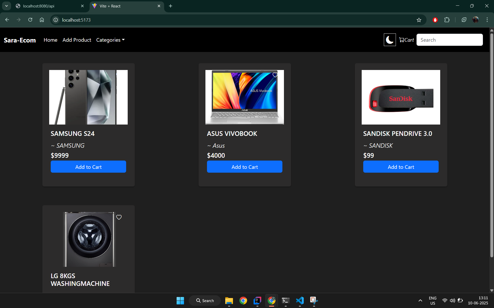
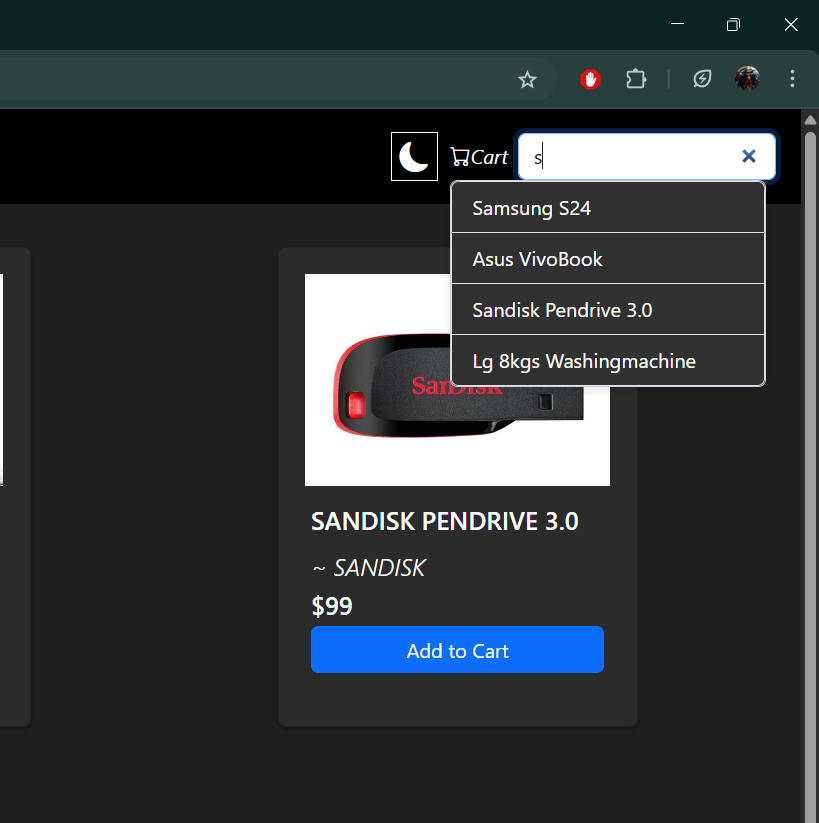
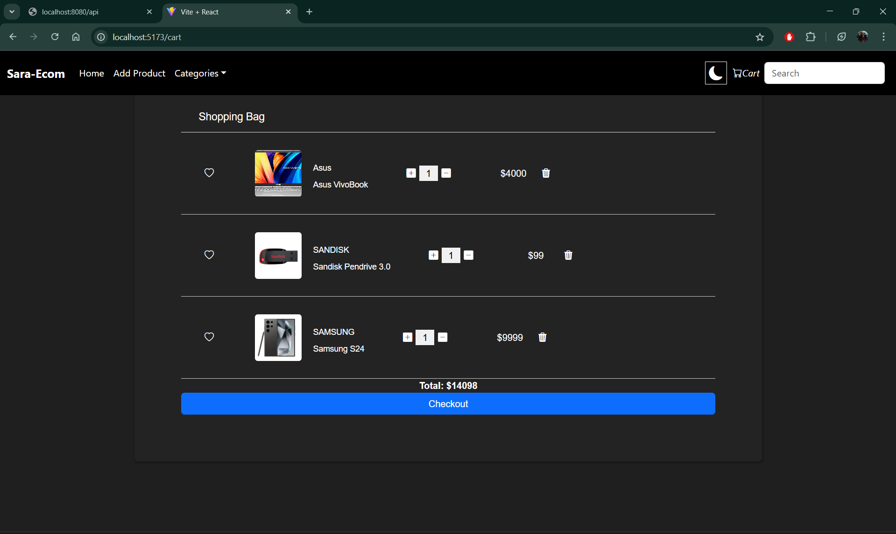
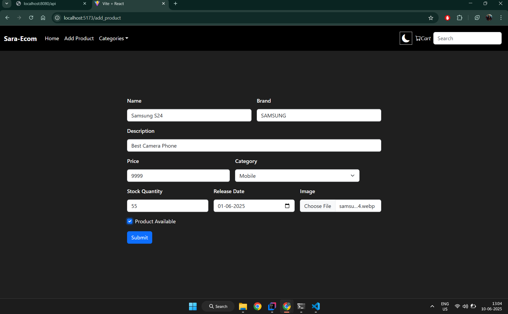
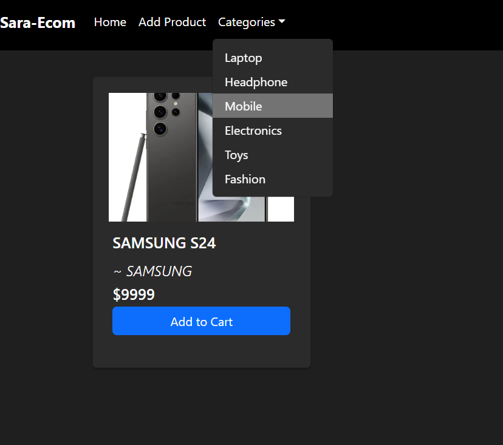
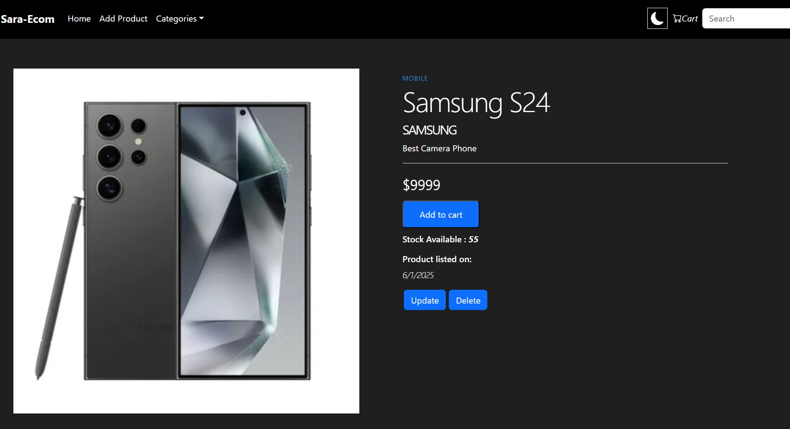

# 🛒 E-commerce Management API

A Spring Boot-based RESTful API for managing an e-commerce platform with features like product management, cart functionality, filtering, and search.

---

## 📸 Screenshots

| Home Page | Product Search | Cart | Add/Edit Product | Filter by Category | Product Display |
|----------|----------------|------|------------------|--------------------|------------------|
|  |  |  |  |  |  |


---

## 🚀 Features

- 🔄 Add, update, and delete products
- 🖼️ Product image fetching
- 🔍 Search products by name, category, or price
- 🛒 Cart functionality with add/remove
- 📦 Filter products by category
- 💸 Display detailed information on products
- ✅ RESTful API structure with proper validations and error handling

---

## 🛠️ Tech Stack

- Java 17+
- Spring Boot
- Spring Data JPA
- Hibernate
- MySQL / H2 (dev)
- Maven
- REST APIs

---

## 📦 Installation

1. Clone the repository:
   ```bash
   git clone https://github.com/sujan-vucha/ecom_management-api.git
   cd "ecom sara"
2. Configure DB in application.properties:
   ```bash
   spring.datasource.url=jdbc:mysql://localhost:3306/ecom_db
   spring.datasource.username=root
   spring.datasource.password=yourpassword

3.Run the application:
```bash
./mvnw spring-boot:run

